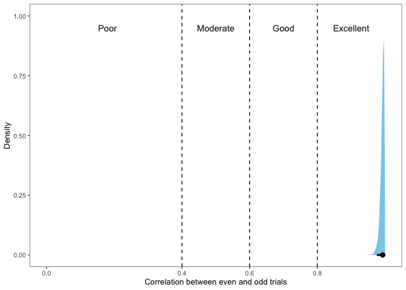
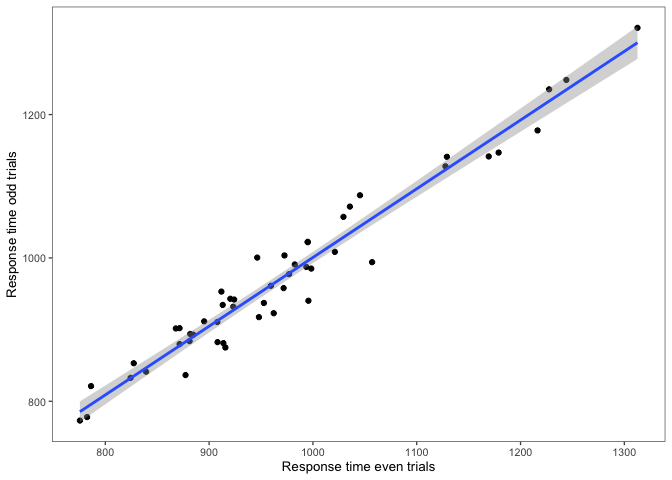
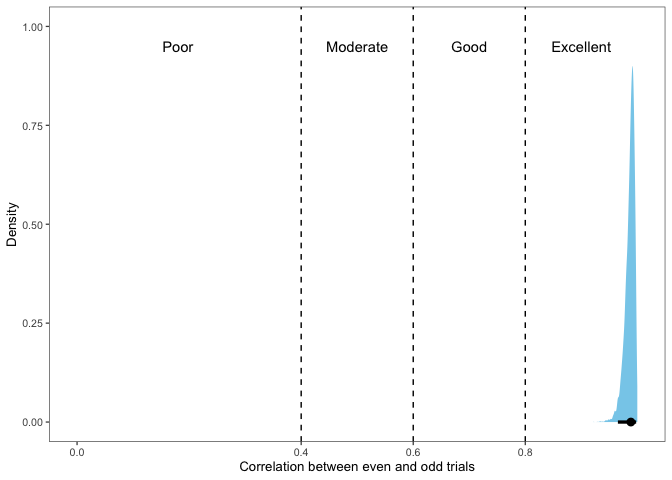
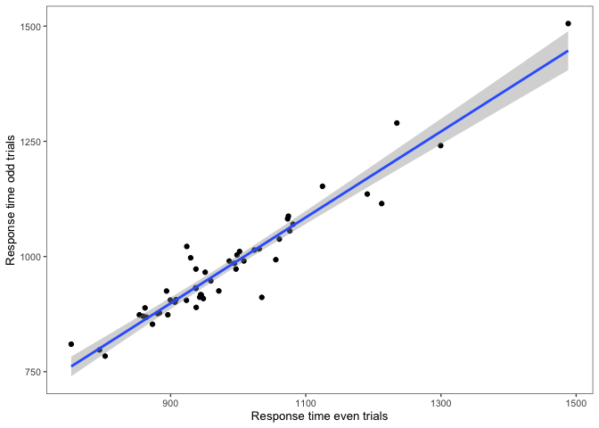
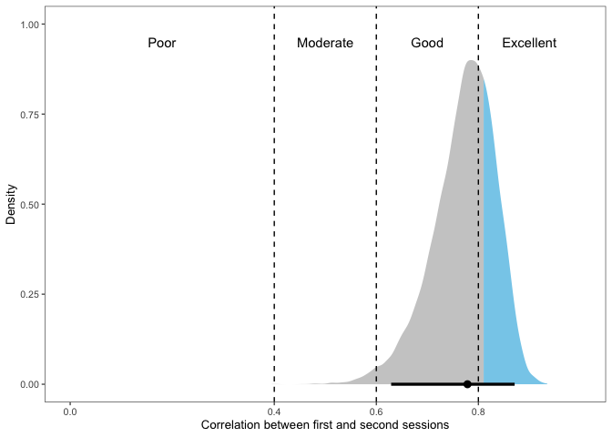
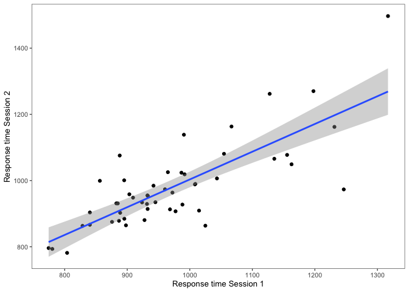

```r
library(tidyverse)
library(ggthemes)
library(brms)
library(tidybayes)
library(posterior)
library(BayesFactor)
library(ggExtra)
library(cowplot)

knitr::opts_chunk$set(echo = TRUE)
options(width = 120)
theme_set(theme_few(base_size = 10))

# Uses the computer cores available
options(mc.cores = parallel::detectCores())
iter <- 4000
warmup <- 2000
chains <- 4
```


# Experiment 1

In Experiment 1, participants completed a simple picture-naming task (i.e., they saw pictures on a computer screen and were asked to say the name of them aloud) in two different sessions. We tested the split-half reliability in each session as well as the test-retest reliability between sessions. 

## Split-half reliability in Session 1

Read in files for Session 1, filter for correct responses only:


```r
# Read in one participant's data to assign column classes to big data frame
test <- read.csv("../data/Experiment1/Session1_ListA/results_5cd49.csv")
colclasses <- sapply(test, typeof)

file_names_a <- list.files(path = "../data/Experiment1/Session1_ListA/", pattern = "*.csv", full.names = TRUE)

file_names_b <- list.files(path = "../data/Experiment1/Session1_ListB/", pattern = "*.csv", full.names = TRUE)

df_a <- map_dfr(file_names_a, read.csv, colClasses = colclasses)
df_b <- map_dfr(file_names_b, read.csv, colClasses = colclasses)

# Combine data frames into one big one and filter for correct responses only
df <- rbind(df_a, df_b) %>%
    filter(Response_Trial == "correct") %>%
    filter(RT > 0)

# Create a column for even/odd trials
df <- df %>%
    group_by(Participant_ID) %>%
    mutate(TrialType = ifelse(Trial_Nbr%%2 == 0, "even", "odd"))
```


### Fit model to test split-half reliability in Session 1


```r
fit_e1_s1_split <- brm(RT ~ 0 + TrialType + (0 + TrialType | Participant_ID) + (1 | Target), family = lognormal(), prior = c(prior(normal(6.75,
    1.5), class = b), prior(normal(0, 1), class = sigma), prior(normal(0, 1), class = sd), prior(lkj(2), class = cor)), iter = iter,
    warmup = warmup, data = df)
```

### Get estimate of correlation and 95% credible interval


```r
fit_e1_s1_split %>%
    spread_draws(cor_Participant_ID__TrialTypeeven__TrialTypeodd) %>%
    mean_hdi(cor_Participant_ID__TrialTypeeven__TrialTypeodd)
```

<div class="kable-table">

| cor_Participant_ID__TrialTypeeven__TrialTypeodd|    .lower|    .upper| .width|.point |.interval |
|-----------------------------------------------:|---------:|---------:|------:|:------|:---------|
|                                       0.9914653| 0.9795127| 0.9999227|   0.95|mean   |hdi       |

</div>

### Plot density of split-half reliability estimate


```r
fit_e1_s1_split %>%
    spread_draws(cor_Participant_ID__TrialTypeeven__TrialTypeodd) %>%
    ggplot(aes(x = cor_Participant_ID__TrialTypeeven__TrialTypeodd, fill = stat(abs(x) > 0.81))) + stat_halfeye(.width = 0.95) +
    labs(x = "Correlation between even and odd trials", y = "Density") + geom_vline(xintercept = c(0.4, 0.6, 0.8), linetype = "dashed") +
    theme(legend.position = "none") + scale_fill_manual(values = c("skyblue", "gray80")) + annotate(geom = "text", x = 0.18,
    y = 0.95, label = "Poor") + annotate(geom = "text", x = 0.5, y = 0.95, label = "Moderate") + annotate(geom = "text",
    x = 0.7, y = 0.95, label = "Good") + annotate(geom = "text", x = 0.9, y = 0.95, label = "Excellent") + scale_x_continuous(breaks = c(0,
    0.4, 0.6, 0.8)) + coord_cartesian(xlim = c(0, 1))
```

<!-- -->

#### Check with frequentist correlation

Just in case we didn't have enough data to estimate the random effect correlations well, we'll test this with a frequentist correlation to make sure the results aren't too different.


```r
df_sum <- df %>%
    group_by(Participant_ID, TrialType) %>%
    summarize(RT_mean = mean(RT))


df_sum_wide <- df_sum %>%
    pivot_wider(names_from = TrialType, values_from = RT_mean)

cor.test(df_sum_wide$even, df_sum_wide$odd)
```

```

	Pearson's product-moment correlation

data:  df_sum_wide$even and df_sum_wide$odd
t = 30.818, df = 48, p-value < 2.2e-16
alternative hypothesis: true correlation is not equal to 0
95 percent confidence interval:
 0.9572659 0.9861802
sample estimates:
      cor 
0.9756492 
```

#### Plot raw data


```r
ggplot(df_sum_wide, aes(x = even, y = odd)) + geom_point() + geom_smooth(method = "lm") + labs(x = "Response time even trials",
    y = "Response time odd trials")
```

<!-- -->


## Split-half reliability in Session 2

Read in files for Session 2, filter for correct responses only:


```r
# Read in one participant's data to assign column classes to big data frame
test_2 <- read.csv("../data/Experiment1/Session2_ListA/results_5cbcc.csv")
colclasses <- sapply(test_2, typeof)

file_names_a_2 <- list.files(path = "../data/Experiment1/Session2_ListA/", pattern = "*.csv", full.names = TRUE)

file_names_b_2 <- list.files(path = "../data/Experiment1/Session2_ListB/", pattern = "*.csv", full.names = TRUE)


df_a_2 <- map_dfr(file_names_a_2, read.csv, colClasses = colclasses)
df_b_2 <- map_dfr(file_names_b_2, read.csv, colClasses = colclasses)

# Combine data frames into one big one and filter for correct responses only
df_2 <- rbind(df_a_2, df_b_2) %>%
    filter(Response_Trial == "correct") %>%
    filter(RT > 0)

# Create a column for even/odd trials
df_2 <- df_2 %>%
    group_by(Participant_ID) %>%
    mutate(TrialType = ifelse(Trial_Nbr%%2 == 0, "even", "odd"))
```

### Fit model to test split-half reliability in Session 2


```r
fit_e1_s2_split <- brm(RT ~ 0 + TrialType + (0 + TrialType | Participant_ID) + (1 | Target), family = lognormal(), prior = c(prior(normal(6.75,
    1.5), class = b), prior(normal(0, 1), class = sigma), prior(normal(0, 1), class = sd), prior(lkj(2), class = cor)), iter = iter,
    warmup = warmup, data = df_2)
```

### Get estimate of correlation and 95% credible interval


```r
fit_e1_s2_split %>%
    spread_draws(cor_Participant_ID__TrialTypeeven__TrialTypeodd) %>%
    mean_hdi(cor_Participant_ID__TrialTypeeven__TrialTypeodd)
```

<div class="kable-table">

| cor_Participant_ID__TrialTypeeven__TrialTypeodd|    .lower|    .upper| .width|.point |.interval |
|-----------------------------------------------:|---------:|---------:|------:|:------|:---------|
|                                       0.9864868| 0.9700289| 0.9992144|   0.95|mean   |hdi       |

</div>

### Plot density of split-half reliability estimate


```r
fit_e1_s2_split %>%
    spread_draws(cor_Participant_ID__TrialTypeeven__TrialTypeodd) %>%
    ggplot(aes(x = cor_Participant_ID__TrialTypeeven__TrialTypeodd, fill = stat(abs(x) > 0.81))) + stat_halfeye(.width = 0.95) +
    labs(x = "Correlation between even and odd trials", y = "Density") + geom_vline(xintercept = c(0.4, 0.6, 0.8), linetype = "dashed") +
    theme(legend.position = "none") + scale_fill_manual(values = c("skyblue", "gray80")) + annotate(geom = "text", x = 0.18,
    y = 0.95, label = "Poor") + annotate(geom = "text", x = 0.5, y = 0.95, label = "Moderate") + annotate(geom = "text",
    x = 0.7, y = 0.95, label = "Good") + annotate(geom = "text", x = 0.9, y = 0.95, label = "Excellent") + scale_x_continuous(breaks = c(0,
    0.4, 0.6, 0.8)) + coord_cartesian(xlim = c(0, 1))
```

<!-- -->

#### Check with frequentist correlation

Just in case we didn't have enough data to estimate the random effect correlations well, we'll test this with a frequentist correlation as well.


```r
df_sum_2 <- df_2 %>%
    group_by(Participant_ID, TrialType) %>%
    summarize(RT_mean = mean(RT))


df_sum_wide_2 <- df_sum_2 %>%
    pivot_wider(names_from = TrialType, values_from = RT_mean)

cor.test(df_sum_wide_2$even, df_sum_wide_2$odd)
```

```

	Pearson's product-moment correlation

data:  df_sum_wide_2$even and df_sum_wide_2$odd
t = 23.161, df = 48, p-value < 2.2e-16
alternative hypothesis: true correlation is not equal to 0
95 percent confidence interval:
 0.9268787 0.9761022
sample estimates:
      cor 
0.9580537 
```

#### Plot raw data


```r
ggplot(df_sum_wide_2, aes(x = even, y = odd)) + geom_point() + geom_smooth(method = "lm") + labs(x = "Response time even trials",
    y = "Response time odd trials")
```

<!-- -->

## Test-retest reliability


```r
df_all <- rbind(df, df_2)

df_all$Session <- as.factor(as.character(df_all$Session))
```


### Fit model for test-retest reliability in Experiment 1


```r
fit_e1_t_rt <- brm(RT ~ 0 + Session + (0 + Session | Participant_ID) + (1 | Target), family = lognormal(), prior = c(prior(normal(6.75,
    1.5), class = b), prior(normal(0, 1), class = sigma), prior(normal(0, 1), class = sd), prior(lkj(2), class = cor)), iter = 10000,
    data = df_all)
```

### Get estimate of correlation and 95% credible interval


```r
fit_e1_t_rt %>%
    spread_draws(cor_Participant_ID__Session1__Session2) %>%
    mean_hdi(cor_Participant_ID__Session1__Session2)
```

<div class="kable-table">

| cor_Participant_ID__Session1__Session2|    .lower|    .upper| .width|.point |.interval |
|--------------------------------------:|---------:|---------:|------:|:------|:---------|
|                               0.768829| 0.6431497| 0.8782983|   0.95|mean   |hdi       |

</div>

### Plot density of split-half reliability estimate


```r
fit_e1_t_rt %>%
    spread_draws(cor_Participant_ID__Session1__Session2) %>%
    ggplot(aes(x = cor_Participant_ID__Session1__Session2, fill = stat(abs(x) > 0.81))) + stat_halfeye(.width = 0.95) + labs(x = "Correlation between first and second sessions",
    y = "Density") + geom_vline(xintercept = c(0.4, 0.6, 0.8), linetype = "dashed") + theme(legend.position = "none") + scale_fill_manual(values = c("gray80",
    "skyblue")) + annotate(geom = "text", x = 0.18, y = 0.95, label = "Poor") + annotate(geom = "text", x = 0.5, y = 0.95,
    label = "Moderate") + annotate(geom = "text", x = 0.7, y = 0.95, label = "Good") + annotate(geom = "text", x = 0.9, y = 0.95,
    label = "Excellent") + scale_x_continuous(breaks = c(0, 0.4, 0.6, 0.8)) + coord_cartesian(xlim = c(0, 1))
```

<!-- -->

#### Check with frequentist correlation

Just in case we didn't have enough data to estimate the random effect correlations well, we'll test this with a frequentist correlation as well.


```r
df_sum_3 <- df_all %>%
    group_by(Participant_ID, Session) %>%
    summarize(RT_mean = mean(RT))


df_sum_wide_3 <- df_sum_3 %>%
    pivot_wider(names_from = Session, values_from = RT_mean)

cor.test(df_sum_wide_3$`1`, df_sum_wide_3$`2`)
```

```

	Pearson's product-moment correlation

data:  df_sum_wide_3$`1` and df_sum_wide_3$`2`
t = 8.7709, df = 48, p-value = 1.545e-11
alternative hypothesis: true correlation is not equal to 0
95 percent confidence interval:
 0.6478801 0.8724905
sample estimates:
      cor 
0.7847154 
```

#### Plot raw data


```r
ggplot(df_sum_wide_3, aes(x = `1`, y = `2`)) + geom_point() + geom_smooth(method = "lm") + labs(x = "Response time Session 1",
    y = "Response time Session 2")
```

<!-- -->

### Accuracy Experiment 1

We decided to eliminate participants who did name at least 60% of the pictures correctly. We also want to report the mean and standard deviation of accuracy, so we compute this here.


```r
acc <- df_all %>%
    group_by(Participant_ID, Session) %>%
    summarize(n = n())

acc <- acc %>%
    mutate(acc = n/150)

acc %>%
    group_by(Session) %>%
    summarize(mean_acc = round(mean(acc), 2))
```

<div class="kable-table">

|Session | mean_acc|
|:-------|--------:|
|1       |     0.95|
|2       |     0.96|

</div>

```r
acc %>%
    group_by(Session) %>%
    summarize(sd_acc = round(sd(acc), 2))
```

<div class="kable-table">

|Session | sd_acc|
|:-------|------:|
|1       |   0.05|
|2       |   0.03|

</div>

```r
acc %>%
    group_by(Session) %>%
    summarize(count = sum(acc < 0.6))
```

<div class="kable-table">

|Session | count|
|:-------|-----:|
|1       |     0|
|2       |     0|

</div>

# Experiment 2

In Experiment 2, participants completed a simple picture-naming task (i.e., they saw pictures on a computer screen and were asked to say the name of them aloud) and the same task again but with time pressure (i.e., a speeded task).

## Split-half reliability in the non-speeded condition

Read in files for the non-speeded condition filter for correct responses only:


```r
# Read in one participant's data to assign column classes to big data frame
test_3 <- read.csv("../data/Experiment2/Exp2_Session1_ListA_NS/results_5bbbc.csv")
colclasses <- sapply(test_3, typeof)

file_names_1_a_ns <- list.files(path = "../data/Experiment2/Exp2_Session1_ListA_NS/", pattern = "*.csv", full.names = TRUE)

file_names_2_a_ns <- list.files(path = "../data/Experiment2/Exp2_Session2_ListA_NS/", pattern = "*.csv", full.names = TRUE)

file_names_1_b_ns <- list.files(path = "../data/Experiment2/Exp2_Session1_ListB_NS/", pattern = "*.csv", full.names = TRUE)

file_names_2_b_ns <- list.files(path = "../data/Experiment2/Exp2_Session2_ListB_NS/", pattern = "*.csv", full.names = TRUE)

df_1ans <- map_dfr(file_names_1_a_ns, read.csv, colClasses = colclasses)
df_2ans <- map_dfr(file_names_2_a_ns, read.csv, colClasses = colclasses)
df_1bns <- map_dfr(file_names_1_b_ns, read.csv, colClasses = colclasses)
df_2bns <- map_dfr(file_names_2_b_ns, read.csv, colClasses = colclasses)

# Combine data frames into one big one and filter for correct responses only
df_e2_ns <- rbind(df_1ans, df_2ans, df_1bns, df_2bns) %>%
    filter(Response_Trial == "correct") %>%
    filter(RT > 0) %>%
    filter(Participant_ID != "5fe39")  # had less than 60% accuracy

# Create a column for even/odd trials
df_e2_ns <- df_e2_ns %>%
    group_by(Participant_ID) %>%
    mutate(TrialType = ifelse(Trial_Nbr%%2 == 0, "even", "odd"))
```

### Fit model to test split-half reliability in Session 1


```r
fit_e2_ns_split <- brm(RT ~ 0 + TrialType + (0 + TrialType | Participant_ID) + (1 | Target), family = lognormal(), prior = c(prior(normal(6.75,
    1.5), class = b), prior(normal(0, 1), class = sigma), prior(normal(0, 1), class = sd), prior(lkj(2), class = cor)), iter = iter,
    warmup = warmup, data = df_e2_ns)
```

### Get estimate of correlation and 95% credible interval


```r
fit_e2_ns_split %>%
    spread_draws(cor_Participant_ID__TrialTypeeven__TrialTypeodd) %>%
    mean_hdi(cor_Participant_ID__TrialTypeeven__TrialTypeodd)
```

<div class="kable-table">

| cor_Participant_ID__TrialTypeeven__TrialTypeodd|   .lower|    .upper| .width|.point |.interval |
|-----------------------------------------------:|--------:|---------:|------:|:------|:---------|
|                                       0.9859038| 0.966139| 0.9998937|   0.95|mean   |hdi       |

</div>

### Plot density of split-half reliability estimate


```r
fit_e2_ns_split %>%
    spread_draws(cor_Participant_ID__TrialTypeeven__TrialTypeodd) %>%
    ggplot(aes(x = cor_Participant_ID__TrialTypeeven__TrialTypeodd, fill = stat(abs(x) > 0.81))) + stat_halfeye(.width = 0.95) +
    labs(x = "Correlation between even and odd trials", y = "Density") + geom_vline(xintercept = c(0.4, 0.6, 0.8), linetype = "dashed") +
    theme(legend.position = "none") + scale_fill_manual(values = c("skyblue", "gray80")) + annotate(geom = "text", x = 0.18,
    y = 0.95, label = "Poor") + annotate(geom = "text", x = 0.5, y = 0.95, label = "Moderate") + annotate(geom = "text",
    x = 0.7, y = 0.95, label = "Good") + annotate(geom = "text", x = 0.9, y = 0.95, label = "Excellent") + scale_x_continuous(breaks = c(0,
    0.4, 0.6, 0.8)) + coord_cartesian(xlim = c(0, 1))
```

<!-- -->

#### Check with frequentist correlation

Just in case we didn't have enough data to estimate the random effect correlations well, we'll test this with a frequentist correlation to make sure the results aren't too different.


```r
df_e2_ns_sum <- df_e2_ns %>%
    group_by(Participant_ID, TrialType) %>%
    summarize(RT_mean = mean(RT))


df_e2_ns_sum_wide <- df_e2_ns_sum %>%
    pivot_wider(names_from = TrialType, values_from = RT_mean)

cor.test(df_e2_ns_sum_wide$even, df_e2_ns_sum_wide$odd)
```

```

	Pearson's product-moment correlation

data:  df_e2_ns_sum_wide$even and df_e2_ns_sum_wide$odd
t = 20.731, df = 44, p-value < 2.2e-16
alternative hypothesis: true correlation is not equal to 0
95 percent confidence interval:
 0.9151734 0.9735549
sample estimates:
      cor 
0.9524351 
```

#### Plot raw data


```r
ggplot(df_e2_ns_sum_wide, aes(x = even, y = odd)) + geom_point() + geom_smooth(method = "lm") + labs(x = "Response time even trials",
    y = "Response time odd trials")
```

<!-- -->

## Split-half reliability in the speeded condition

Read in files for the speeded condition filter for correct responses only:


```r
# Read in one participant's data to assign column classes to big data frame
test_4 <- read.csv("../data/Experiment2/Exp2_Session1_ListA_S/results_5f31a.csv")
colclasses <- sapply(test_4, typeof)

file_names_1_a_s <- list.files(path = "../data/Experiment2/Exp2_Session1_ListA_S/", pattern = "*.csv", full.names = TRUE)

file_names_1_b_s <- list.files(path = "../data/Experiment2/Exp2_Session1_ListB_S/", pattern = "*.csv", full.names = TRUE)

file_names_2_a_s <- list.files(path = "../data/Experiment2/Exp2_Session2_ListA_S/", pattern = "*.csv", full.names = TRUE)

file_names_2_b_s <- list.files(path = "../data/Experiment2/Exp2_Session2_ListB_S/", pattern = "*.csv", full.names = TRUE)

df_1as <- map_dfr(file_names_1_a_s, read.csv, colClasses = colclasses)
df_1bs <- map_dfr(file_names_1_b_s, read.csv, colClasses = colclasses)
df_2as <- map_dfr(file_names_2_a_s, read.csv, colClasses = colclasses)
df_2bs <- map_dfr(file_names_2_b_s, read.csv, colClasses = colclasses)

# Combine data frames into one big one and filter for correct responses only
df_e2_s <- rbind(df_1as, df_1bs, df_2as, df_2bs) %>%
    filter(Response_Trial == "correct") %>%
    filter(RT > 0) %>%
    filter(Participant_ID != "5fe39")  # had less than 60% accuracy

# Create a column for even/odd trials
df_e2_s <- df_e2_s %>%
    group_by(Participant_ID) %>%
    mutate(TrialType = ifelse(Trial_Nbr%%2 == 0, "even", "odd"))
```

### Fit model to test split-half reliability in Session 1


```r
fit_e2_s_split <- brm(RT ~ 0 + TrialType + (0 + TrialType | Participant_ID) + (1 | Target), family = lognormal(), prior = c(prior(normal(6.75,
    1.5), class = b), prior(normal(0, 1), class = sigma), prior(normal(0, 1), class = sd), prior(lkj(2), class = cor)), iter = iter,
    warmup = warmup, data = df_e2_s)
```

### Get estimate of correlation and 95% credible interval


```r
fit_e2_s_split %>%
    spread_draws(cor_Participant_ID__TrialTypeeven__TrialTypeodd) %>%
    mean_hdi(cor_Participant_ID__TrialTypeeven__TrialTypeodd)
```

<div class="kable-table">

| cor_Participant_ID__TrialTypeeven__TrialTypeodd|    .lower|    .upper| .width|.point |.interval |
|-----------------------------------------------:|---------:|---------:|------:|:------|:---------|
|                                       0.9895268| 0.9746436| 0.9997011|   0.95|mean   |hdi       |

</div>

### Plot density of split-half reliability estimate


```r
fit_e2_s_split %>%
    spread_draws(cor_Participant_ID__TrialTypeeven__TrialTypeodd) %>%
    ggplot(aes(x = cor_Participant_ID__TrialTypeeven__TrialTypeodd, fill = stat(abs(x) > 0.81))) + stat_halfeye(.width = 0.95) +
    labs(x = "Correlation between even and odd trials", y = "Density") + geom_vline(xintercept = c(0.4, 0.6, 0.8), linetype = "dashed") +
    theme(legend.position = "none") + scale_fill_manual(values = c("skyblue", "gray80")) + annotate(geom = "text", x = 0.18,
    y = 0.95, label = "Poor") + annotate(geom = "text", x = 0.5, y = 0.95, label = "Moderate") + annotate(geom = "text",
    x = 0.7, y = 0.95, label = "Good") + annotate(geom = "text", x = 0.9, y = 0.95, label = "Excellent") + scale_x_continuous(breaks = c(0,
    0.4, 0.6, 0.8)) + coord_cartesian(xlim = c(0, 1))
```

<!-- -->

#### Check with frequentist correlation

Just in case we didn't have enough data to estimate the random effect correlations well, we'll test this with a frequentist correlation to make sure the results aren't too different.


```r
df_e2_s_sum <- df_e2_s %>%
    group_by(Participant_ID, TrialType) %>%
    summarize(RT_mean = mean(RT))


df_e2_s_sum_wide <- df_e2_s_sum %>%
    pivot_wider(names_from = TrialType, values_from = RT_mean)

cor.test(df_e2_s_sum_wide$even, df_e2_s_sum_wide$odd)
```

```

	Pearson's product-moment correlation

data:  df_e2_s_sum_wide$even and df_e2_s_sum_wide$odd
t = 25.635, df = 45, p-value < 2.2e-16
alternative hypothesis: true correlation is not equal to 0
95 percent confidence interval:
 0.9419417 0.9818281
sample estimates:
      cor 
0.9674254 
```

#### Plot raw data


```r
ggplot(df_e2_s_sum_wide, aes(x = even, y = odd)) + geom_point() + geom_smooth(method = "lm") + labs(x = "Response time even trials",
    y = "Response time odd trials")
```

<!-- -->

## Test-retest reliability


```r
df_all_e2 <- rbind(df_e2_ns, df_e2_s)

df_all_e2 <- df_all_e2 %>%
    mutate(Type_Trial = case_when(Type_Trial == "naming" ~ "nonspeeded", Type_Trial == "peeded" ~ "speeded"))

df_all_e2$Type_Trial <- as.factor(as.character(df_all_e2$Type_Trial))
```


### Fit model for reliability over conditions in Experiment 2


```r
fit_e2_s_ns <- brm(RT ~ 0 + Type_Trial + (0 + Type_Trial | Participant_ID) + (1 | Target), family = lognormal(), prior = c(prior(normal(6.75,
    1.5), class = b), prior(normal(0, 1), class = sigma), prior(normal(0, 1), class = sd), prior(lkj(2), class = cor)), iter = 10000,
    warmup = warmup, data = df_all_e2)
```

### Get estimate of correlation and 95% credible interval


```r
fit_e2_s_ns %>%
    spread_draws(cor_Participant_ID__Type_Trialnonspeeded__Type_Trialspeeded) %>%
    mean_hdi(cor_Participant_ID__Type_Trialnonspeeded__Type_Trialspeeded)
```

<div class="kable-table">

| cor_Participant_ID__Type_Trialnonspeeded__Type_Trialspeeded|    .lower|    .upper| .width|.point |.interval |
|-----------------------------------------------------------:|---------:|---------:|------:|:------|:---------|
|                                                   0.6917011| 0.5246909| 0.8478187|   0.95|mean   |hdi       |

</div>

### Plot density of split-half reliability estimate


```r
fit_e2_s_ns %>%
    spread_draws(cor_Participant_ID__Type_Trialnonspeeded__Type_Trialspeeded) %>%
    ggplot(aes(x = cor_Participant_ID__Type_Trialnonspeeded__Type_Trialspeeded, fill = stat(abs(x) > 0.81))) + stat_halfeye(.width = 0.95) +
    labs(x = "Correlation between speeded and non-speeded conditions", y = "Density") + geom_vline(xintercept = c(0.4, 0.6,
    0.8), linetype = "dashed") + theme(legend.position = "none") + scale_fill_manual(values = c("gray80", "skyblue")) + annotate(geom = "text",
    x = 0.18, y = 0.95, label = "Poor") + annotate(geom = "text", x = 0.5, y = 0.95, label = "Moderate") + annotate(geom = "text",
    x = 0.7, y = 0.95, label = "Good") + annotate(geom = "text", x = 0.9, y = 0.95, label = "Excellent") + scale_x_continuous(breaks = c(0,
    0.4, 0.6, 0.8)) + coord_cartesian(xlim = c(0, 1))
```

<!-- -->

#### Check with frequentist correlation

Just in case we didn't have enough data to estimate the random effect correlations well, we'll test this with a frequentist correlation as well.


```r
df_sum_e2 <- df_all_e2 %>%
    group_by(Participant_ID, Type_Trial) %>%
    summarize(RT_mean = mean(RT))


df_sum_wide_e2 <- df_sum_e2 %>%
    pivot_wider(names_from = Type_Trial, values_from = RT_mean)

cor.test(df_sum_wide_e2$nonspeeded, df_sum_wide_e2$speeded)
```

```

	Pearson's product-moment correlation

data:  df_sum_wide_e2$nonspeeded and df_sum_wide_e2$speeded
t = 5.7995, df = 44, p-value = 6.646e-07
alternative hypothesis: true correlation is not equal to 0
95 percent confidence interval:
 0.4548172 0.7963449
sample estimates:
      cor 
0.6582101 
```

#### Plot raw data


```r
ggplot(df_sum_wide_e2, aes(x = nonspeeded, y = speeded)) + geom_point() + geom_smooth(method = "lm") + labs(x = "Response time non-speeded condition",
    y = "Response time speeded condition")
```

```
Warning: Removed 1 rows containing non-finite values (stat_smooth).
```

```
Warning: Removed 1 rows containing missing values (geom_point).
```

<!-- -->

### Accuracy Experiment 2

We decided to eliminate participants who did name at least 60% of the pictures correctly. We also want to report the mean and standard deviation of accuracy, so we compute this here.


```r
acc_e2 <- df_all_e2 %>%
    group_by(Participant_ID, Type_Trial) %>%
    summarize(n = n())

acc_e2 <- acc_e2 %>%
    mutate(acc = n/150)

acc_e2 %>%
    group_by(Type_Trial) %>%
    summarize(mean_acc = round(mean(acc), 2))
```

<div class="kable-table">

|Type_Trial | mean_acc|
|:----------|--------:|
|nonspeeded |     0.96|
|speeded    |     0.91|

</div>

```r
acc_e2 %>%
    group_by(Type_Trial) %>%
    summarize(sd_acc = round(sd(acc), 2))
```

<div class="kable-table">

|Type_Trial | sd_acc|
|:----------|------:|
|nonspeeded |   0.03|
|speeded    |   0.06|

</div>

```r
acc_e2 %>%
    group_by(Type_Trial) %>%
    summarize(count = sum(acc < 0.6))
```

<div class="kable-table">

|Type_Trial | count|
|:----------|-----:|
|nonspeeded |     0|
|speeded    |     0|

</div>

## Speed-accuracy tradeoff


```r
accuracy <- rbind(df_1ans, df_2ans, df_1bns, df_2bns, 
                  df_1as, df_2as, df_1bs, df_2bs)

accuracy <- accuracy %>%
  mutate(acc = ifelse(Response_Trial == "correct", 1, 0)) %>%
  filter(Participant_ID != "5fe39") %>% # less than 60% correct
  mutate(Type_Trial = 
           case_when(
             Type_Trial == "naming" ~ "nonspeeded",
             Type_Trial == "peeded" ~ "speeded"
             )
  )

accuracy$Type_Trial <- as.factor(as.character(accuracy$Type_Trial))
```


```r
fit_e2_acc <- brm(acc ~ 0 + Type_Trial + (0 + Type_Trial | Participant_ID) + (1 | Target), family = bernoulli(), prior = c(prior(normal(0,
    1.5), class = b), prior(normal(0, 1), class = sd), prior(lkj(2), class = cor)), iter = iter, warmup = warmup, data = accuracy)
```


Extract group level estimates from accuracy and RT models


```r
acc_ns <- data.frame(coef(fit_e2_acc)$Participant_ID[, , 1][, 1])
acc_s <- data.frame(coef(fit_e2_acc)$Participant_ID[, , 2][, 1])
rt_ns <- data.frame(coef(fit_e2_s_ns)$Participant_ID[, , 1][, 1])
rt_s <- data.frame(coef(fit_e2_s_ns)$Participant_ID[, , 2][, 1])

acc_ns$Participant_ID <- rownames(acc_ns)
colnames(acc_ns)[1] <- "acc_ns"
acc_s$Participant_ID <- rownames(acc_s)
colnames(acc_s)[1] <- "acc_s"
rt_ns$Participant_ID <- rownames(rt_ns)
colnames(rt_ns)[1] <- "rt_ns"
rt_s$Participant_ID <- rownames(rt_s)
colnames(rt_s)[1] <- "rt_s"

acc_rt <- merge(merge(merge(acc_ns, acc_s, ), rt_ns, ), rt_s, by = "Participant_ID")
```

Compute correlations


```r
corr_ns <- correlationBF(acc_rt$rt_ns, acc_rt$acc_ns)
bayestestR::describe_posterior(corr_ns, centrality = "mean")
```

<div class="kable-table">

|Parameter |       Mean|   CI|     CI_low|   CI_high|    pd| ROPE_CI| ROPE_low| ROPE_high| ROPE_Percentage|     log_BF|        BF|Prior_Distribution | Prior_Location| Prior_Scale|
|:---------|----------:|----:|----------:|---------:|-----:|-------:|--------:|---------:|---------------:|----------:|---------:|:------------------|--------------:|-----------:|
|rho       | -0.2038227| 0.95| -0.4665634| 0.0700407| 0.932|    0.95|    -0.05|      0.05|       0.1034211| -0.0002743| 0.9997257|beta               |              3|           3|

</div>

```r
cor.test(acc_rt$rt_ns, acc_rt$acc_ns)
```

```

	Pearson's product-moment correlation

data:  acc_rt$rt_ns and acc_rt$acc_ns
t = -1.5995, df = 43, p-value = 0.117
alternative hypothesis: true correlation is not equal to 0
95 percent confidence interval:
 -0.49600019  0.06079576
sample estimates:
      cor 
-0.236967 
```

```r
corr_s <- correlationBF(acc_rt$rt_s, acc_rt$acc_s)
bayestestR::describe_posterior(corr_s, centrality = "mean")
```

<div class="kable-table">

|Parameter |       Mean|   CI|     CI_low|   CI_high|      pd| ROPE_CI| ROPE_low| ROPE_high| ROPE_Percentage|   log_BF|       BF|Prior_Distribution | Prior_Location| Prior_Scale|
|:---------|----------:|----:|----------:|---------:|-------:|-------:|--------:|---------:|---------------:|--------:|--------:|:------------------|--------------:|-----------:|
|rho       | -0.2404523| 0.95| -0.4895897| 0.0427807| 0.95325|    0.95|    -0.05|      0.05|       0.0628947| 0.501144| 1.650608|beta               |              3|           3|

</div>

```r
cor.test(acc_rt$rt_s, acc_rt$acc_s)
```

```

	Pearson's product-moment correlation

data:  acc_rt$rt_s and acc_rt$acc_s
t = -1.9441, df = 43, p-value = 0.05845
alternative hypothesis: true correlation is not equal to 0
95 percent confidence interval:
 -0.53327950  0.01014087
sample estimates:
       cor 
-0.2842391 
```


```r
corr_ns_plot <- ggplot(acc_rt, aes(rt_ns, acc_ns)) + geom_point(color = "#440154FF", alpha = 0.5, size = 5) + geom_smooth(method = "lm",
    size = 0.5, color = "black") + labs(x = "", y = "Picture naming accuracy\n")

corr_ns_plot_mh <- ggMarginal(corr_ns_plot, type = "histogram")

corr_s_plot <- ggplot(acc_rt, aes(rt_s, acc_s)) + geom_point(color = "#440154FF", alpha = 0.5, size = 5) + geom_smooth(method = "lm",
    size = 0.5, color = "black") + labs(x = "", y = "")

corr_s_plot_mh <- ggMarginal(corr_s_plot, type = "histogram")

plot_row <- plot_grid(corr_ns_plot_mh, corr_s_plot_mh, labels = c("Non-speeded", "Speeded"), align = "hv")

xlabel <- ggdraw() + draw_label("Picture naming response time", size = 12)

plot_grid(plot_row, xlabel, nrow = 2, rel_heights = c(1, 0.05))
```

<!-- -->
